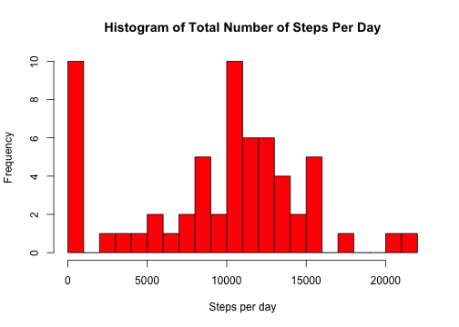
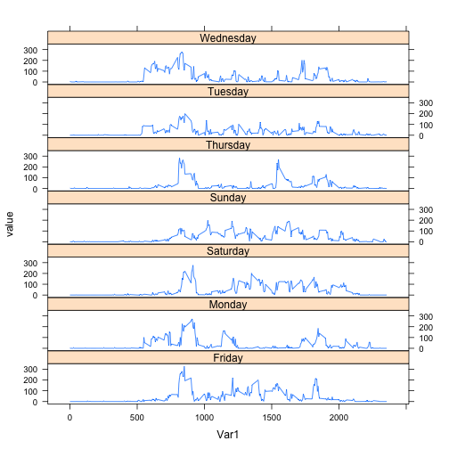
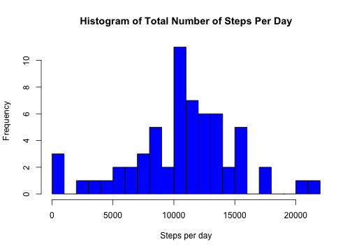
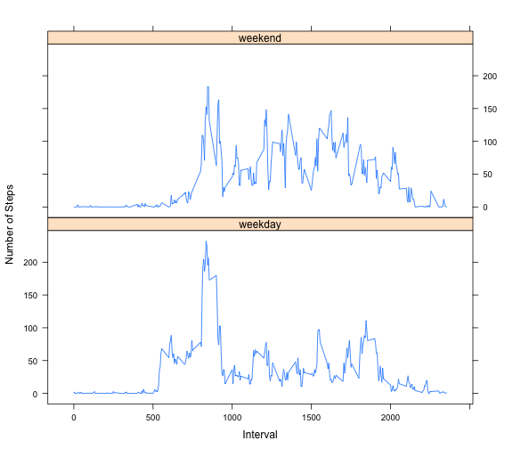

# Reproducible Research: Peer Assessment 1
*by Jeffrey R. Millard, PhD*

This analysis uses data from a personal activity monitoring device.  The data are 2 months of the number of steps taken in 5-minute intervals.  There is a single test subject for which the data were collected.

## 1. Loading and preprocessing the data

### 1.1 Load the data

The data file was already available in the forked repository for this assignment, and could be downloaded by hyperlink from the assignment description web page. Therefore, I have not incorporated the code to download and unzip the data.

The data file was downloaded on June 11, 2014, at 10:58 AM from the assignment page link:  https://d396qusza40orc.cloudfront.net/repdata%2Fdata%2Factivity.zip

and on Mac OSX 10.9.3, this file downloads as "repdata-data-activity.zip"

Data are loaded using read.csv(), and specifying the columns for date and interval as factors, with steps as integers.  Initially, NA values (for steps)
are left alone. There are no NA values for date and interval.


```r
# Starting point: data has been downloaded and zip file extracted
# with resulting file "activity.csv".  No other preprocessing has 
# been performed at this point.

# make sure we are in the correct directory
setwd("~/RepData_PeerAssessment1")

# load data into data.frame DF, do not touch NA values yet
# cast date column as a factor
DF <- read.csv("activity.csv", 
		colClasses = c("integer", "factor", "integer"))

# and to have something to look at, run summary(DF)
summary(DF)
```

```
##      steps               date          interval   
##  Min.   :  0.0   2012-10-01:  288   Min.   :   0  
##  1st Qu.:  0.0   2012-10-02:  288   1st Qu.: 589  
##  Median :  0.0   2012-10-03:  288   Median :1178  
##  Mean   : 37.4   2012-10-04:  288   Mean   :1178  
##  3rd Qu.: 12.0   2012-10-05:  288   3rd Qu.:1766  
##  Max.   :806.0   2012-10-06:  288   Max.   :2355  
##  NA's   :2304    (Other)   :15840
```

Interesting to note that the maximum number of steps in a 5-minute interval was 806, which works out to around 161 steps per minute.  According to http://www.ontherunevents.com/ns0060.htm, this translates to about (depending of course on stride length) to ~ 4.6mi/hr (7.4 km/hr), roughly a 13 minute mile. 

### 1.2 Process/transform the data

Thus far, the only transformation is setting dates as factors. There are a few more to come as I proceed, but some are not convenient to do yet.  The transformations that will occur over the course of this analysis are:

1. Cast "date" as a factor, in order to calculate total steps per day and the mean of total steps per day. 
2. Create weekday column ("Monday", "Tuesday",...), then a 2-level factor column ("Weekday", "Weekend") for weekday/weekend activity comparison.

## 2. What is mean total number of steps taken per day?

The mean per **interval** is actually found in the summary(DF) output above, but that is not the mean per **day**.  To get that, we need to calculate the total number of steps per day for each day, and then comnpute the mean for those 61 days.

### 2.1 Histogram of total steps per day

I used tapply() to calculate sums for each date.  Since this generates a data frame with 61 columns and 2 rows, and we want 61 rows and 2 columns, I used the reshape2 package function melt() to reformat.


```r
require(reshape2)
```

```
## Loading required package: reshape2
```

```r
daysum.DF <- melt(tapply(DF$steps, INDEX=DF$date, FUN=sum, na.rm=TRUE))
```

Next, construct a histogram of the steps per day:


```r
hist(daysum.DF$value, col="red", xlab="Steps per day", breaks=20, 
	main="Histogram of Total Number of Steps Per Day")
```

 

### 2.2 Mean and median steps per day

It is easy to get this using summary(), or you could use mean() and median()


```r
summary(daysum.DF)
```

```
##          Var1        value      
##  2012-10-01: 1   Min.   :    0  
##  2012-10-02: 1   1st Qu.: 6778  
##  2012-10-03: 1   Median :10395  
##  2012-10-04: 1   Mean   : 9354  
##  2012-10-05: 1   3rd Qu.:12811  
##  2012-10-06: 1   Max.   :21194  
##  (Other)   :55
```

```r
mean(daysum.DF$value)
```

```
## [1] 9354
```

```r
median(daysum.DF$value)
```

```
## [1] 10395
```

## 3. What is the average daily activity pattern?

### 3.1 Time series plot of activity

Once again, I have used tapply() and melt() to get activity by time of day.


```r
timemean.DF <- melt(tapply(DF$steps, INDEX=DF$interval, FUN=mean, na.rm=TRUE))
summary(timemean.DF)
```

```
##       Var1          value       
##  Min.   :   0   Min.   :  0.00  
##  1st Qu.: 589   1st Qu.:  2.49  
##  Median :1178   Median : 34.11  
##  Mean   :1178   Mean   : 37.38  
##  3rd Qu.:1766   3rd Qu.: 52.83  
##  Max.   :2355   Max.   :206.17
```

A time series plot of the activity:


```r
plot(timemean.DF$Var1, timemean.DF$value, type="l", xlab="5-Minute Time Interval Number", ylab="Mean Number of Steps", main="Average Number of Steps by 5-Minute Interval")
```

 

In case you haven't noticed, the interval labels are hour+minute, so 505 is actually 5:05am.  Therefore, there is a gap after each interval ending in 55, and the last interval is 2355, even though there are 1440 minutes in a day.

Thus, the subject generally gets up at around 5:30am, exercises (or does some vigorous activity) from 8:00am to 9:00am, and goes to bed around 10:30pm.  There are other, smaller activity peaks from 3:30pm-4:20pm and 6:15-7:15pm.

### 3.2 5-minute interval with maximum average number of steps

The which.max() function was used:


```r
timemean.DF[which.max(timemean.DF$value),]
```

```
##     Var1 value
## 104  835 206.2
```

This shows that the 5-minute interval with maximum average number of steps occurred in time interval 835, which is 8:35am.

## 4. Imputing missing values

### 4.1 Total number of NAs in the data set

Note that the only column with NA values is "steps"; summary() provides this information, as does sum(is.na())


```r
summary(DF)
```

```
##      steps               date          interval   
##  Min.   :  0.0   2012-10-01:  288   Min.   :   0  
##  1st Qu.:  0.0   2012-10-02:  288   1st Qu.: 589  
##  Median :  0.0   2012-10-03:  288   Median :1178  
##  Mean   : 37.4   2012-10-04:  288   Mean   :1178  
##  3rd Qu.: 12.0   2012-10-05:  288   3rd Qu.:1766  
##  Max.   :806.0   2012-10-06:  288   Max.   :2355  
##  NA's   :2304    (Other)   :15840
```

```r
sum(is.na(DF$steps))
```

```
## [1] 2304
```

### 4.2 Strategy for filling in missing values

After considering what methods could be used for imputing the missing data, I decided to see if there was a pattern where the missing data occurred.  It turns out that there are identically 8 missing values for every time interval, and that the missing data is due to entire missing days, as shown by the 2 plots below.

**These plots were not requested by the assignment**, but are important in driving my choice of imputation method, so I have included them. I also wanted to know if there were particular days of the week that tended to be missing more often, so I added a weekday column.


```r
DF$weekday <- weekdays(as.POSIXlt(DF$date))
DF$nacount <- is.na(DF$steps)
nacount.DF <- melt(tapply(DF$nacount, INDEX=DF$interval, FUN=sum, na.rm=TRUE))

plot(nacount.DF$Var1, nacount.DF$value, type="l", xlab="5-Minute Time Interval Number", ylab="Number of NA values", main="NA Values by 5-Minute Interval")
```

 


```r
nacount.DF <- melt(tapply(DF$nacount, INDEX=DF$date, FUN=sum, na.rm=TRUE))
plot(nacount.DF$Var1, nacount.DF$value, type="l", xlab="Date", ylab="Number of NA values", main="NA Values by Date")
```

 

Since it doesn't matter which interval we choose, we can find out the dates that are missing by checking any interval for NA values.


```r
DF[DF$interval==0 & is.na(DF$steps),]
```

```
##       steps       date interval   weekday nacount
## 1        NA 2012-10-01        0    Monday    TRUE
## 2017     NA 2012-10-08        0    Monday    TRUE
## 8929     NA 2012-11-01        0  Thursday    TRUE
## 9793     NA 2012-11-04        0    Sunday    TRUE
## 11233    NA 2012-11-09        0    Friday    TRUE
## 11521    NA 2012-11-10        0  Saturday    TRUE
## 12673    NA 2012-11-14        0 Wednesday    TRUE
## 17281    NA 2012-11-30        0    Friday    TRUE
```

No obvious bias toward particular days of the week missing.

It seems unlikely the data recording stopped and started almost magically at midnight, so I assume that the person who recorded the data removed data for particular days, for reasons unknown.  

Therefore, **the strategy should address how to replace entire missing days**. We can do this either by selecting entire days, or selecting intervals.  I favor selecting days, because selecting (random) intervals could result in construction of days with meaningless activity patterns - suddenly going from running to inactivity and back again, for example.

Possible strategies considered included:

1. Repeat previous day ("Hot deck")  
2. Random sampling from set of all not-NA days ("Cold deck")  
3. Mean of all days ("Mean imputation")  
4. Mean of same day of week (e.g., replace missing Sunday with "mean" Sunday)  
5. Mean of same type of day (e.g., replace missing Monday with "mean" weekday)  
6. Mean of random sample 1 to n days  

I did not like option 3, since all that does is keep the same means and artificially decrease the variance.  Looking into options 4 and 5, I generated a quick plot of activity by day of the week **(also not requested by the assignment)**


```r
# using lattice graphics
require(lattice)
```

```
## Loading required package: lattice
```

```r
# revise timemean.DF to use weekday factors
timemean.DF <- melt(tapply(DF$steps, INDEX=list(DF$interval,DF$weekday), FUN=mean, na.rm=TRUE))

# compare days; since this is just a quick exploration, I am not bothering to
# reorder plots to follow order of days of week
xyplot(value ~ Var1 | Var2, data=timemean.DF, layout=c(1,7), pch=NA, type="l")
```

 

Looks like our subject works out everyday but Sunday?  Looking at this, I chose strategy #2, taking a random sample from all not-NA days, since it was hard to argue that there was enough pronounced variation in the days.

### 4.3 New data set with imputed values


* clone original, excluding dates that have no data
* create 2nd set consisting of random sample of 8 days
* generate a list of the NA dates to replace
* generate a list of non-NA dates
* for each of the 8 newly sampled dates, replace date values with the orginal NA dates


The steps to making the new data set with imputed values:

* clone the original data set
* generate a list of the NA dates to replace
* generate a list of non-NA dates
* 


```r
# getting rid of nacount column, since we no longer need it
DF$nacount <- NULL

# create imputed.DF by cloning DF with NA records removed
cleaned.DF <- DF[!is.na(DF$steps),]

# remove unused days from factor list
cleaned.DF <- droplevels(cleaned.DF)

# randomly pick 8 days from cleaned.DF to duplicate
# 	sample(levels(cleaned.DF$date), 8) picks the 8 days
#	%in% is used to pick everything matching those 8 days
set.seed(17)
newdaylist <- as.character(sample(levels(cleaned.DF$date), 8))
extradays.DF <- cleaned.DF[cleaned.DF$date %in% newdaylist,]

olddaylist <- as.character(droplevels(DF$date[DF$interval==0 & is.na(DF$steps)]))

extradays.DF$date <- as.character(extradays.DF$date)

for (i in 1:length(newdaylist)) {
	extradays.DF[extradays.DF$date==newdaylist[i],"date"] <- olddaylist[i]
}

# rbind() these together.  Could order by date, but there is no real need to
imputed.DF <- rbind(cleaned.DF, extradays.DF)

summary(imputed.DF)
```

```
##      steps             date          interval      weekday         
##  Min.   :  0   2012-10-02:  288   Min.   :   0   Length:17568      
##  1st Qu.:  0   2012-10-03:  288   1st Qu.: 589   Class :character  
##  Median :  0   2012-10-04:  288   Median :1178   Mode  :character  
##  Mean   : 37   2012-10-05:  288   Mean   :1178                     
##  3rd Qu.: 12   2012-10-06:  288   3rd Qu.:1766                     
##  Max.   :806   2012-10-07:  288   Max.   :2355                     
##                (Other)   :15840
```

### 4.4 Histogram, mean and median of new data set

#### Histogram

```r
daysum2.DF <- melt(tapply(imputed.DF$steps, INDEX=imputed.DF$date, FUN=sum, na.rm=TRUE))

hist(daysum2.DF$value, col="blue", xlab="Steps per day", breaks=20, 
	main="Histogram of Total Number of Steps Per Day")
```

 
Compared to original


```r
hist(daysum.DF$value, col="red", xlab="Steps per day", breaks=20, 
	main="Histogram of Total Number of Steps Per Day")
```

 
#### Mean and median 


```r
summary(daysum2.DF)
```

```
##          Var1        value      
##  2012-10-02: 1   Min.   :   41  
##  2012-10-03: 1   1st Qu.: 8821  
##  2012-10-04: 1   Median :10765  
##  2012-10-05: 1   Mean   :10668  
##  2012-10-06: 1   3rd Qu.:13452  
##  2012-10-07: 1   Max.   :21194  
##  (Other)   :55
```

```r
mean(daysum2.DF$value)
```

```
## [1] 10668
```

```r
median(daysum2.DF$value)
```

```
## [1] 10765
```

#### Comparison of imputed and original data sets


```r
a <- data.frame("Original Data", mean(daysum.DF$value), median(daysum.DF$value), sd(daysum.DF$value))
names(a) <- c("Data Set", "Mean", "Median", "StdDev")
b <- data.frame("Imputed Data", mean(daysum2.DF$value), median(daysum2.DF$value), sd(daysum2.DF$value))
names(b) <- c("Data Set", "Mean", "Median", "StdDev")
compare.DF <- rbind(a,b)
compare.DF
```

```
##        Data Set  Mean Median StdDev
## 1 Original Data  9354  10395   5406
## 2  Imputed Data 10668  10765   4382
```

There are differences in the mean and median total number of steps, as would be expected by random resampling to add 8 days to the data set.

## 5. Are there differences in activity patterns between weekdays and weekends?

### 5.1 New factor variable "weekday", "weekend"

I already included a "weekday" column earlier for data exploration, so I will use this to generate a weekday vs weekend comparison.  Per instructions, I used the set with imputed data.


```r
imputed.DF$typeofday <- as.factor(ifelse(imputed.DF$weekday %in% c("Saturday", "Sunday"), "weekend", "weekday"))
```
### 5.2 Time series panel plot comparing weekday and weekend activity


```r
# weekday vs weekend
timemean2.DF <- melt(tapply(imputed.DF$steps, 
				   INDEX=list(imputed.DF$interval,imputed.DF$typeofday), 
				   FUN=mean, na.rm=TRUE))

# compare days; since this is just a quick exploration, I am not bothering to
# reorder plots to follow order of days of week
xyplot(value ~ Var1 | Var2, data=timemean2.DF, layout=c(1,2), pch=NA, type="l",
	 ylab="Number of Steps", xlab="Interval")
```

 
